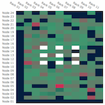

# EHN1 Cluster Monitoring using CERN Grafana API

Table of Content:

  * [Features](#features)
  * [Testing enviroment](#testing-enviroment)
  * [How to calculate  cluster room temperature](#how-to-calculate--cluster-room-temperature)
  * [Configuration](#configuration)
  * [Updating configuration file](#updating-configuration-file)
    + [Some attributes:](#some-attributes-)
    + [Edit extended content (project details, etc)](#edit-extended-content--project-details--etc)
    + [Edit nodes log  content (fail, error, etc)](#edit-nodes-log--content--fail--error--etc)
	+ [Add historic  time range](#add-more-history-time-intervals)
    + [Deploying changes](#deploying-changes)
  * [How to add a repository to OpenShift without credentials](#how-to-add-a-repository-to-openshift-without-credentials)

*Authors: Nectarios Benekos, Agathangelos Stylianidis and Manuel Parra-Royon.*

This is the repository of a new complementary Monitoring Web Tool for the EHN1 Cluster (aprox. 200 computing nodes).
This application allows to know the state of the nodes of the cluster, both in a general and individualized way. 
It is designed using GRANAFA's API REST, which guarantees the continuity and uniformity of the data in accordance with the data exchange interface proposed in CERN in this document: https://monit-docs.web.cern.ch/ (See SubSection **Grafana Proxy**).

## Features

- To visualize the data in real time, connecting with the data of the snapshots provided by the API of GRAFANA.
- To control the complete state of the infrastructure at a glance, HEATMAP with UPTIME, NETWORK, SYSLOAD, or TEMPERATURE among others.
- To monitor the main variable state of individual nodes, such as CPU, network transfers, workload, disk storage, or temperatures.
- To know the cluster room temperature (averaging the temperature of external nodes in the central area).
- To check the history of monitoring variables during distinct time periods (from a day to months).


## Testing enviroment

The testing environment is deprecated and now is working in production in: http://np-cmp.web.cern.ch/ (deployed, but cluster is power down).

## How to calculate  the cluster room temperature

To do this, a set of nodes is taken from the central part of the cluster room, an average of the external temperature is made covering 9 nodes.



The white nodes are those used to average the temperature of the cluster room.

## Configuration

All the features are configurable, from the texts that appear in the monitoring site to the node pool that shows the infrastructure array:

Open ```configuration.json``` file to make changes in the project data.

**Include:**

- Refresh time .
- Grouping of the data.
- Queries (and addition of new queries) of the API of Grafana
- Website text
- Extended text of the project data.
- etc.

After add new changes, you must **Deploy** or **Start Build** in the OpenShift site.


## Updating configuration file

In order to modify some simple parameters of the application, it is necessary to change a few variables inside the configuration.json file.

Remember that to modify JSON file you have to take into account the following considerations:

- JSON does not support code comments.
- The variables are in the form ``"VAR1":"Content"`` ending in ``,`` 


### Some attributes 

Several attributes can be modified and added, among them:

**Head Text** :

```
"head_text":"Welcome to ENH1-NP Cluster Monitoring Tool",
```

**Sub Header Text**:

```
"subhead_text":"Real-time monitoring for protoDUNE / DUNE computing infrastructure",
```

**Change the color of the project title and header**:
```
"_colorhtml_detail_project_title":"#ecb807",
```

### Edit extended content (project details, etc)

**Path to the project extended description and details in Markdown** :

```
"detail_project_test":"content/detail.md",
```

In order to change the text of the project, please add/modify the following file in the repository [content/detail.md](content/detail.md).
The file is formatted with Markdown. [Use this tutorial in order to add Markdown content.](https://commonmark.org/help/)


### Edit nodes log  content (fail, error, etc)

Path to the nodes log content in Markdown :

```
"nodes_information":"content/nodes_information.md",
```

In order to change the text of the project, please add/modify the following file in the repository [content/nodes_information.md](content/nodes_information.md).
The file is formatted with Markdown. [Use this tutorial in order to add Markdown content.](https://commonmark.org/help/)


### Add more history time intervals

Go to the index.php, at the end of the file, you will see (in JS):

```
	// History Range and Interval:

	$("#btn_1d_monit").on('click', function(event) {
		// 1day of statistics and 30 mins of grouping
		location.href="./?node=<?php if (isset($_GET['node'])) echo $_GET['node'];?>&range=1d&group=30m&status=<?php if (isset($_GET['status'])) echo $_GET['status'];?>";
	});
	...

```

Add to the end of this list of events for instace, an history reviewver of 3 months:

Note: range is **180** days and group is **2** days.

```
	$("#btn_3m_monit").on('click', function(event) {
		// 1day of statistics and 30 mins of grouping
		location.href="./?node=<?php if (isset($_GET['node'])) echo $_GET['node'];?>&range=180d&group=2d&status=<?php if (isset($_GET['status'])) echo $_GET['status'];?>";
	});
```


### Deploying changes

If you have made any changes to the repository (modifying some of the variables or texts) from GITLAB source coder repo, save your changes and go to [CERN NP-CMP OpenShift](https://openshift.cern.ch/console/project/np-cmp/) to make a ```Build``` again.


## How to add a repository to OpenShift without credentials

In order to add a repository in OpenShift without using credentials passed by the URL, we must to follow the next steps:

https://cern.service-now.com/service-portal/article.do?n=KB0004565


